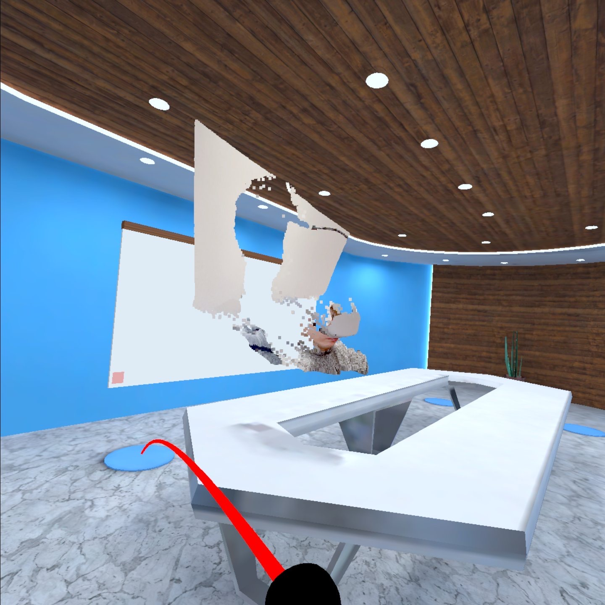

# Remote Telepresence using AR and VR
*Combining Augument and Virtual Reality for Remote Collaboration*

This project has been developed as part of my Master's Degree dissertation.
The software sample enable the real-time transmission using point clouds of a 3D scene captured with a mobile device to a VR headset.



## Installation / Getting started

1. **Run WebSocket Server**
2. **Launch iPhone client**
3. **Launch VR client**

## Building the project

### Steps:
- Clone the project
- Launch the WebSocket server:
```
cd WebSocket
nom install
node app.js
```

## Versions Used
- [Unity for Mac Release 2021.2.7f1](https://unity3d.com/unity/whats-new/2021.2.7)
- [Unity AR Foundation](https://docs.unity3d.com/Packages/com.unity.xr.arfoundation@4.1/manual/index.html)
- [Unity XR Interaction Toolkit](https://docs.unity3d.com/Packages/com.unity.xr.interaction.toolkit@0.9/manual/index.html)

## Links
- Reference projects:
  - iPad LiDAR Depth Sample for Unity: https://github.com/TakashiYoshinaga/iPad-LiDAR-Depth-Sample-for-Unity
  - VR Online Office Template: https://assetstore.unity.com/packages/tools/network/vr-online-office-template-182766

## Licensing
Licensed under the [MIT License](./LICENSE).
